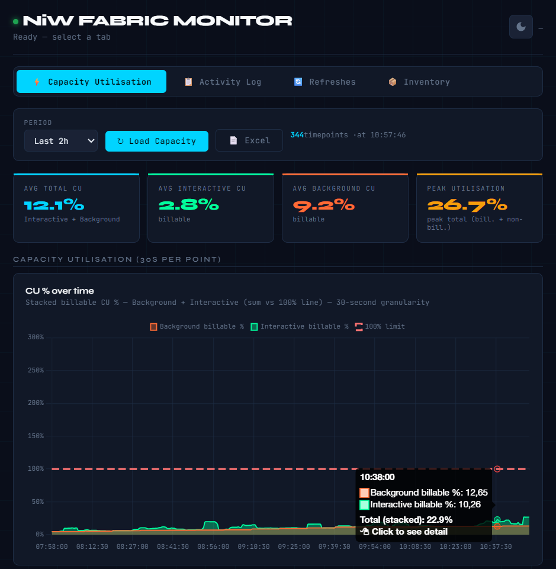
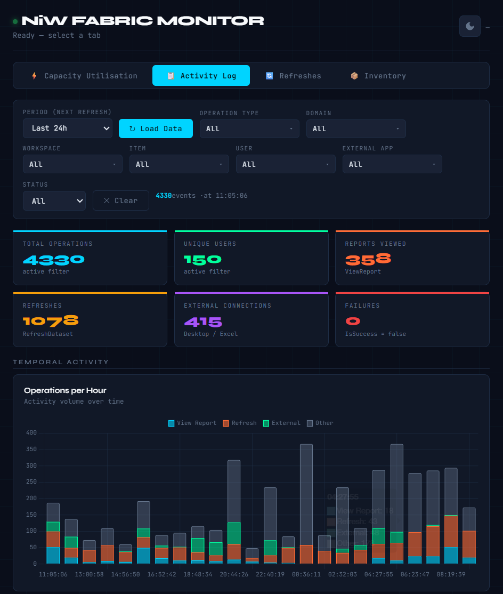
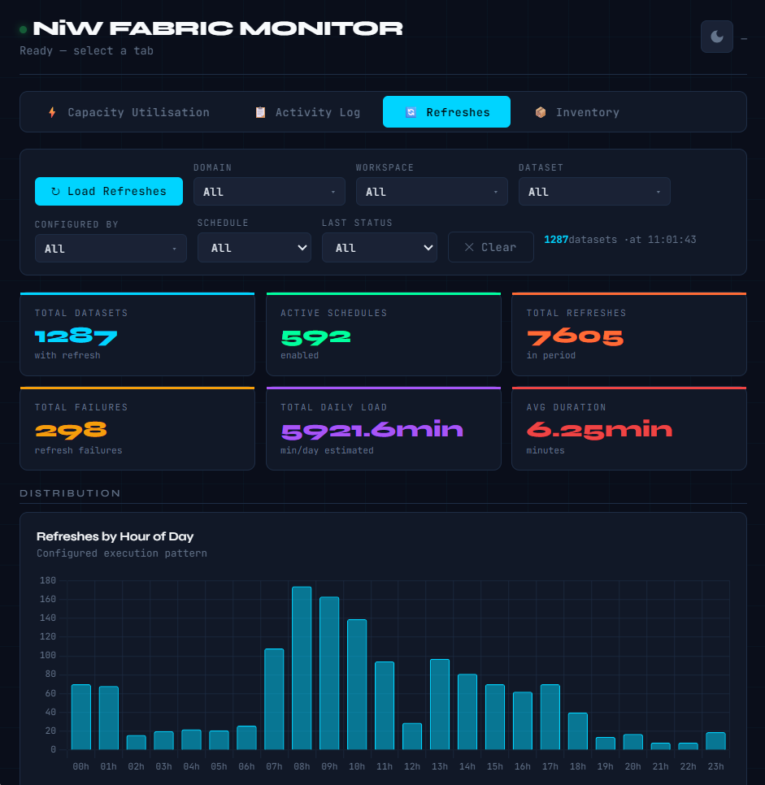
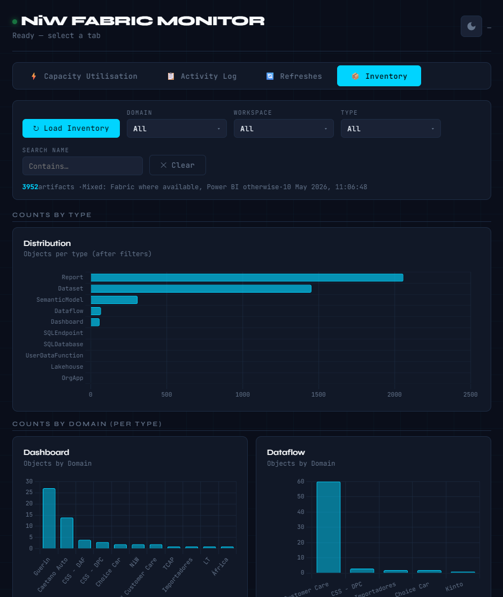

# Fabric Monitor

[](https://github.com/rui-caio/fabric-monitor)

<p align="center">
  
  &nbsp;
  
  <br/>
  <br/>
  
  &nbsp;
  
</p>

A local monitoring dashboard for **Microsoft Fabric** capacities — tracks compute unit consumption, user activity, and dataset refresh metrics in real time through a browser-based interface.

> 💡 **Note:** This tool runs entirely locally and its execution does not consume any compute units (CUs) from your Fabric capacity.

---

## Features

### Capacity Utilisation Tab

Visualises compute unit (CU) consumption over time by querying the **Microsoft Fabric Capacity Metrics** semantic model via DAX.

- **Interactive vs Background breakdown** — stacked area chart showing billable CU consumption split by operation type. Interactive operations are user-triggered (report loads, queries); background operations run autonomously (refreshes, scheduled flows)
- **SKU CU % chart** — total capacity utilisation as a percentage of the SKU ceiling, computed from all four components: interactive billable, background billable, interactive non-billable, and background non-billable CU
- **Four KPI cards** — average billable CU, average interactive CU, average background CU, and peak total utilisation over the selected period
- **Configurable time window** — load the last 1, 2, 4, 6, 12, 24, or 48 hours of data
- **Sortable detail table** — every timepoint listed with its Interactive %, Background %, and computed SKU CU %, colour-coded by severity thresholds
- **Timepoint drill-down panel** — click any bar on the chart to open a side panel with the full operation list for that 30-second timepoint:
  - Switch between **Interactive** and **Background** operation modes
  - **Group by** any combination of dimensions: **Domain**, **Workspace**, **Item**, **Item Kind**, **Operation**, **Status**, and **User** — metrics are aggregated across the active grouping
  - **Filter pills** for each dimension — multi-value dropdown filters applied locally without an extra API call
  - Metric summary cards showing total CU (s), Timepoint CU (s), Duration (s), and % Capacity for the current view
  - CU bar chart per row to visualise relative cost at a glance
  - Export to Excel with all active grouping dimensions and metrics

---

### Activity Log Tab

Reads Power BI user activity events from the **Power BI Activity Events Admin API**, with hourly chunking and local disk cache to avoid redundant API calls.

- **Six KPI cards** — total operations, unique users, reports viewed (ViewReport), refreshes triggered (RefreshDataset), external connections (ConnectFromExternalApplication), and failures (IsSuccess = false)
- **Operations per Hour chart** — stacked bar chart by hour with four series: View Report, Refresh, External, and Other — shows demand pattern over the selected period
- **Distribution by Hour of Day** — bar chart showing which hours of the day see the most activity, regardless of date, useful for identifying peak usage windows
- **Access Method chart** — breaks down how users connect: Power BI Desktop (MSOLAP), Excel, Azure Client, Web Browser, System/API, or Other — derived from UserAgent when ConsumptionMethod is absent
- **Artifact Type chart** — distribution of operations by ArtifactKind or ObjectType (Report, Dashboard, Dataset, Dataflow, etc.)
- **Operation Type chart** — top 12 operation types by frequency, covering the full range of Power BI activity event names
- **Rankings section** — top 15 leaderboards for: most-viewed reports, most-accessed datasets, most-active users, most-active workspaces, external applications (by AppName/UserAgent), and operations with the most failures
- **Multi-select filters** — filter by **domain**, **operation type**, **workspace**, **item**, and **user** simultaneously; a status toggle filters for successful or failed events only. Filters are applied client-side on cached data; when the dataset is truncated the backend is re-queried with the active filter set to return full results
- **Sortable detail table** — up to 500 rows displayed, sortable by any column (Time, Domain, Operation, User, Item, Workspace, App, Method, IP, Status); includes operation-type colour badges that, when clicked, open a modal displaying the full JSON payload of the event
- **Configurable time window** — from the last hour up to the last 30 days; the cache stores data per hour-long chunk so re-loading a previously fetched range is instantaneous. To prevent disk bloat, a garbage collector runs automatically to purge cache files older than 32 days.
- **Large dataset handling** — when the event count exceeds 10,000, only the most recent events are sent to the browser; a warning banner explains the truncation and filters trigger a fresh server-side query
- **Export to Excel** — exports all current activity rows with columns: Time, Domain, Operation, User, Item, Workspace, Method, IP, Status

---

### Refreshes Tab

Reads dataset refresh metadata from the **Power BI Capacity Refreshables Admin API**, including schedule configuration, historical statistics, and per-dataset performance.

- **Six KPI cards** — total datasets with refresh configured, active schedules, total refreshes executed in the period, total failures, total estimated daily load (minutes), and average refresh duration
- **Refreshes by Hour of Day chart** — distribution of scheduled refresh times across 24 hours, showing when the capacity is under most scheduled load
- **Last Refresh Status donut** — proportion of datasets with their last refresh in Completed, Failed, or Unknown state
- **Duration Distribution chart** — histogram of average refresh durations bucketed into six ranges (< 0.5 min, 0.5–1 min, 1–5 min, 5–15 min, 15–30 min, > 30 min)
- **Rankings section** — top 15 datasets by: daily load (avg duration × refreshes per day), total refreshes executed, total failures, and average duration; each with a proportional bar
- **Filters** — multi-select by **Domain**, **Workspace**, **Dataset**, and **Configured by**; dropdowns for schedule status (Active / Inactive / No schedule) and last refresh status (Completed / Failed / Unknown)
- **Sortable detail table** — all datasets with columns: Domain, Workspace, Dataset, Configured By, Schedule status badge, Ref/Day (actual count from schedule times, not the capacity maximum), Times, Days, Avg Duration (min), Load/Day (min), Total Ref., Failures, Last Status, Last Refresh timestamp. Duration and load columns are colour-coded: amber above 5 min average, red above 30 min daily load
- **Export to Excel** — exports the full filtered dataset list with all columns

---

### Inventory Tab

Lists artefacts in **workspaces assigned to the configured capacity** (`CAPACITY_ID`). Intended for Fabric/Power BI administrators who can call tenant Admin APIs.

- **Workspace discovery** — `GET /admin/groups` with OData filter `capacityId eq '{CAPACITY_ID}'` (the non-admin path `/capacities/{id}/workspaces` does not exist). If Admin APIs are forbidden, the app falls back to `GET /groups` and keeps workspaces whose `capacityId` matches.
- **Power BI enumeration (default)** — uses **bulk tenant-wide Admin APIs** with pagination (`/admin/reports`, `/admin/datasets`, `/admin/dashboards`, `/admin/dataflows`) and **filters in memory** to the capacity workspace set. This avoids hundreds of per-workspace calls that trigger HTTP **429** throttling.
- **Fabric enumeration (optional)** — if a token for scope `Workspace.Read.All` is acquired, **List Items** is used per workspace for full Fabric types (lakehouses, notebooks, etc.). Workspaces covered by Fabric skip the Power BI pass for that workspace. Fallback mechanisms handle 429 Rate Limits automatically.
- **Dynamic Domain Charts** — dynamic distribution bar charts automatically generated per artifact type, grouping object counts by Domain.
- **UI** — filters (Domain, Workspace, Type, name search), counts by type, sortable table (including Domain mapping), Excel export.

Microsoft documents **strict rate limits** on Admin list APIs (for example, low requests per minute per tenant). Very large tenants may still hit 429; retry later or rely on caching if you add it later.

---

## Requirements

### System

| Requirement | Minimum version |
| ----------- | --------------- |
| Python | 3.8+ |
| pip | any recent version |

### Python library

```bash
pip install msal
```

All other dependencies (`json`, `urllib`, `http.server`, `threading`) are part of the Python standard library — no additional installations required.

### Browser

Any modern browser with ES6+ support (Chrome, Edge, Firefox, Safari).
Chart.js is loaded automatically via CDN — internet access is required on first load.

---

## Microsoft / Azure Prerequisites

### 1. Azure Active Directory (Entra ID)

- An account with **Power BI Admin** or **Fabric Admin** permissions in the tenant
- The **Tenant ID** of your Azure AD

> How to find it: [portal.azure.com](https://portal.azure.com) → Azure Active Directory → Overview → **Directory (tenant) ID**

### 2. Microsoft Fabric Capacity

- An active Fabric capacity (F-SKU or P-SKU)
- The **Capacity ID** of the capacity to monitor

> How to find it: [app.powerbi.com](https://app.powerbi.com) → Admin Portal → Capacity Settings → select the capacity → the ID appears in the URL or in the settings panel

### 3. Microsoft Fabric Capacity Metrics app

The capacity utilisation data is read through the official **Microsoft Fabric Capacity Metrics** app (**version 65**), which must be installed in your tenant.

> 💡 **Important:** It is highly recommended to install the Capacity Metrics app in a **Pro** workspace rather than a Premium/Fabric workspace. This ensures that the queries made by this dashboard to read the metrics do not consume CUs from the capacity you are monitoring.

You need two IDs from that app's dataset:

| Variable | What it is |
| -------- | ---------- |
| `METRICS_WS` | ID of the workspace where the Capacity Metrics app is installed |
| `METRICS_DS` | ID of the Capacity Metrics app's dataset |

> How to find them: open the Capacity Metrics app workspace in Power BI → click on the dataset → the URL has the format:
> `app.powerbi.com/groups/{METRICS_WS}/datasets/{METRICS_DS}`

### 4. Required permissions

The account used for authentication needs:

- `Tenant.Read.All` or `Tenant.ReadWrite.All` — for the Activity Log API
- **Viewer** access (or higher) to the Capacity Metrics workspace
- **Fabric Administrator** or **Power BI Administrator** role in the tenant — to access the Capacity and Refreshables APIs

---

## Installation

### 1. Clone the repository

```bash
git clone https://github.com/rui-caio/fabric-monitor.git
cd fabric-monitor
```

### 2. Install dependencies

```bash
pip install msal
```

### 3. Configure the `.env` file

Copy the example file and fill in your values:

```bash
cp .env.example .env
```

Open `.env` and fill in:

```env
TENANT_ID=xxxxxxxx-xxxx-xxxx-xxxx-xxxxxxxxxxxx
CAPACITY_ID=xxxxxxxx-xxxx-xxxx-xxxx-xxxxxxxxxxxx
METRICS_WS=xxxxxxxx-xxxx-xxxx-xxxx-xxxxxxxxxxxx
METRICS_DS=xxxxxxxx-xxxx-xxxx-xxxx-xxxxxxxxxxxx
ORG_NAME=Your Org
PORT=8765

# Optional: Timezone for the UI (IANA format or UTC offset)
DISPLAY_TIMEZONE=Europe/Lisbon
# DISPLAY_UTC_OFFSET_HOURS=1

# Optional: authentication mode (see "Authentication" below)
# AUTH_TYPE=public
# AUTH_TYPE=client_secret
# CLIENT_ID=
# CLIENT_SECRET=
```

> **Important:** The `.env` file is listed in `.gitignore` and must never be committed or shared. It contains sensitive configuration values (including `CLIENT_SECRET` if you use service principal auth).

### Authentication

The app supports two authentication modes, controlled with **`AUTH_TYPE`** in `.env` (default: **`public`**).

| Mode | When to use | Main `.env` fields |
| ---- | ----------- | ------------------ |
| **`public`** | Interactive sign-in (typical for a user who is a Power BI / Fabric admin). | `TENANT_ID` and the capacity/metrics variables. `CLIENT_ID` is optional: if unset, the built-in Power BI public client is used for **Device Code** sign-in. |
| **`client_secret`** | Unattended / server runs using a **service principal** (app registration with a client secret). | **`TENANT_ID`**, **`CLIENT_ID`**, **`CLIENT_SECRET`**, plus the same capacity and metrics variables. |

**`client_secret` (service principal) — required setup**

1. **App registration** in Microsoft Entra ID for a confidential client, with **Application** permissions (not only delegated) for the APIs you need, and **admin consent** on the tenant. The app uses client credentials with scopes like `https://analysis.windows.net/powerbi/api/.default` for Power BI, and `https://api.fabric.microsoft.com/.default` for Fabric (List Items, domains, etc.) when you need those features. Grant exactly what your organisation allows: for example **Power BI** application permissions for tenant read / admin operations, and **Fabric** if you use inventory or domain features.
2. **Capacity Metrics workspace access (mandatory for utilisation and timepoint drill-down):** The service principal must have access to the **same Power BI workspace** whose ID you set in **`METRICS_WS`** — the workspace where the **Microsoft Fabric Capacity Metrics** app and its dataset are installed. Add the app (enterprise application / service principal) as a **Member** (or at least with permission to use the dataset) in that workspace. If Execute Queries is blocked by policy, grant **Build** (or the minimum required) on the **Capacity Metrics** dataset. If this step is skipped, the **Capacity** and **timepoint** API calls often return **404** (`PowerBIFolderNotFound` / workspace cannot be found) because the API resolves the workspace for the **application identity**, not your personal user.
3. For **Activity**, **Refreshes**, and **Inventory**, the same service principal may need the appropriate **Power BI / Fabric** application roles and, where relevant, access to the same capacity and workspaces you expect a human admin to see. Align with your identity team; permission names differ between delegated and application-only access.

**`public` mode**

- First run uses the **Device Code** flow; the token is cached in **`.token_cache.bin`** (local, not committed to git). Subsequent runs reuse the cache until it expires or is deleted.
- If you do not need a custom app, leave **`CLIENT_ID`** empty in `.env` for this mode.

---

## Usage

### Start the server

```bash
python fabric_proxy.py
```

### Authentication (first run)

**`AUTH_TYPE=client_secret`:** there is no device code. The process acquires a token for the app using **`CLIENT_ID`** and **`CLIENT_SECRET`**. The **service principal** must be allowed to use the **Capacity Metrics** workspace (`METRICS_WS`); see *Authentication* above.

**`AUTH_TYPE=public` (default):** the terminal may show a **device code** on first run, for example:

```
────────────────────────────────────────────────────────────
  AUTHENTICATION REQUIRED
────────────────────────────────────────────────────────────

  1. Open: https://microsoft.com/devicelogin
  2. Code:  XXXX-XXXX

  Waiting...
```

1. Open your browser at `https://microsoft.com/devicelogin`
2. Enter the code shown in the terminal
3. Sign in with your Microsoft account with the required permissions
4. Return to the terminal — authentication completes automatically

The token is cached securely to a local file (`.token_cache.bin`). On subsequent runs, authentication is usually silent — you will not have to use the device code again until the cache is cleared or the refresh token is invalid.

> With **`client_secret`**, there is no `.token_cache.bin` for user tokens; MSAL keeps app-only tokens in memory for the process lifetime.

### Open the dashboard

Once authenticated, open your browser at:

```
http://localhost:8765
```

The dashboard is also accessible from other machines on the same local network at `http://<your-ip>:8765`. The server prints the local IP address on startup.

### Stop the server

```
Ctrl+C
```

---

## Project structure

```
fabric-monitor/
├── fabric_proxy.py        # Entry point — starts the HTTP server
├── config.py              # Loads .env and exposes configuration constants
├── auth.py                # MSAL: public (Device Code) or client credentials; optional Fabric scope
├── server.py              # HTTP request handler and main()
│
├── api/
│   ├── activity.py        # /api/activity — user activity events with disk cache
│   ├── capacity.py        # /api/capacity — CU consumption via DAX
│   ├── timepoint.py       # /api/timepoint — per-timepoint operation drill-down
│   ├── refreshes.py       # /api/refreshes — dataset refresh metrics
│   └── inventory.py       # /api/inventory — capacity workspace artefact inventory
│
├── static/
│   └── index.html         # Frontend (HTML + CSS + JavaScript + Chart.js)
│
├── .cache/
│   └── activityevents/    # Hourly activity event cache (auto-created)
│
├── .env                   # Local configuration (do NOT commit)
├── .env.example           # Configuration template
└── .gitignore
```

---

## Local API endpoints

The server exposes the following endpoints at `http://localhost:8765`:

| Method | Endpoint | Description |
| ------ | -------- | ----------- |
| `GET` | `/` | Serves the frontend HTML |
| `POST` | `/api/ping` | Health check |
| `POST` | `/api/auth_status` | Current authentication state and account |
| `POST` | `/api/activity` | Activity events for a date range (with optional filters) |
| `POST` | `/api/capacity` | CU consumption for the last N hours |
| `POST` | `/api/timepoint` | Operation detail for a specific timepoint |
| `POST` | `/api/refreshes` | Dataset refresh metrics and schedules |
| `POST` | `/api/inventory` | Artefact inventory for workspaces on the configured capacity |

---

## Microsoft APIs used

| API | Purpose |
| --- | ------- |
| [Power BI Activity Events API](https://learn.microsoft.com/en-us/rest/api/power-bi/admin/get-activity-events) | User activity log |
| [Power BI Capacity Refreshables API](https://learn.microsoft.com/rest/api/power-bi/capacities/get-refreshables-for-capacity) | Dataset refresh metrics and schedules |
| [Power BI Execute Queries API](https://learn.microsoft.com/en-us/rest/api/power-bi/datasets/execute-queries-in-group) | DAX queries against the Capacity Metrics dataset |
| [Power BI Admin — Groups](https://learn.microsoft.com/en-us/rest/api/power-bi/admin/groups-get-groups-as-admin), [Reports/Datasets/Dashboards/Dataflows as Admin](https://learn.microsoft.com/en-us/rest/api/power-bi/admin) | Inventory: workspaces on capacity + tenant-wide artefact lists (filtered server-side) |

Optional: [Microsoft Fabric REST — List Items](https://learn.microsoft.com/en-us/rest/api/fabric/core/items/list-items) with a user token (delegated `Workspace.Read.All` in cache) or, for applications, the corresponding Fabric **application** permissions and `https://api.fabric.microsoft.com/.default`.

- **`public` mode** uses the [MSAL device code](https://learn.microsoft.com/en-us/azure/active-directory/develop/msal-authentication-flows#device-code) (or cache) for Power BI (`https://analysis.windows.net/powerbi/api/.default`); no client secret.
- **`client_secret` mode** uses the [client credentials](https://learn.microsoft.com/en-us/azure/active-directory/develop/v2-oauth2-client-creds-grant-flow) flow with the configured app id and secret.

---

## Environment variables

| Variable | Required | Description |
| -------- | -------- | ----------- |
| `TENANT_ID` | Yes | Azure AD tenant ID |
| `CAPACITY_ID` | Yes | ID of the Fabric capacity to monitor |
| `METRICS_WS` | Yes | Workspace ID of the Capacity Metrics app |
| `METRICS_DS` | Yes | Dataset ID of the Capacity Metrics app |
| `AUTH_TYPE` | No (default: `public`) | `public` — device code / cached user; `client_secret` (alias: `client_credentials`, `sp`) — service principal |
| `CLIENT_ID` | If `client_secret` | App (application) id from Entra ID. Optional for `public` (default built-in PBI client) |
| `CLIENT_SECRET` | If `client_secret` | Client secret of the app registration |
| `ORG_NAME` | No | Organisation name shown in the dashboard title |
| `PORT` | No (default: `8765`) | Local server port |
| `DISPLAY_TIMEZONE` | No | IANA timezone name (e.g. `Europe/Lisbon`) for UI display |
| `DISPLAY_UTC_OFFSET_HOURS` | No | Fixed UTC offset in hours (ignored if `DISPLAY_TIMEZONE` is set) |

---

## Troubleshooting

### `ERROR: missing configuration variables`

The `.env` file is missing or incomplete. Make sure you copied `.env.example` and filled in all required values.

### `ERROR: 'msal' library not found`

```bash
pip install msal
```

### Authentication fails or expires

The MSAL token is held in memory only. Restarting the server will prompt for authentication again. If the account lacks sufficient permissions, the device code flow completes but API calls return 403.

### `Activity API error 403`

The authenticated account does not have **Power BI Administrator** or **Fabric Administrator** role. Contact your tenant administrator.

### `Capacity API error 404` or empty data

Verify that `METRICS_WS` and `METRICS_DS` match the workspace and dataset of the **Microsoft Fabric Capacity Metrics** app (**version 65**) in your tenant. If you use **`client_secret`**, the **service principal** must be added to that **same workspace** (see *Authentication* above) — a 404 on `PowerBIFolderNotFound` often means the app identity has no access to the workspace, not a wrong id for your own user.

### Dashboard shows the server is not reachable

The Python server is not running or is using a different port. Confirm that `python fabric_proxy.py` is active in the terminal and that the `PORT` value in `.env` matches the URL you are accessing.

### Inventory: HTTP 429 or "Retry in … seconds"

Power BI **Admin** list APIs enforce per-tenant throttling. The app uses **bulk** `/admin/reports` (and datasets, dashboards, dataflows) with pagination instead of per-workspace calls to minimise requests. If the tenant is very large, wait for the retry window or run the inventory again later.

### Inventory: empty or incomplete without Admin rights

Listing workspaces by `capacityId` requires **GetGroupsAsAdmin** (or the non-admin fallback with visible `capacityId` on `GET /groups`). Enumerating artefacts requires **GetReportsAsAdmin** and related Admin endpoints, or **Fabric List Items** with a valid Fabric token.

---

## Dependencies

| Dependency | Version | Source |
| ---------- | ------- | ------ |
| `msal` | any | `pip install msal` |
| `Chart.js` | 4.4.1 | CDN (loaded automatically) |
| `JetBrains Mono` | — | Google Fonts (loaded automatically) |
| `Syne` | — | Google Fonts (loaded automatically) |

---

## Security

- Configuration values (`TENANT_ID`, `CAPACITY_ID`, etc.) are read from environment variables / `.env` file and never hardcoded
- The `.env` file is excluded from git via `.gitignore` — **never** commit it, especially if it contains **`CLIENT_SECRET`**
- In **`public`** mode, Microsoft sign-in uses **Device Code** (or cached token); no app password in `.env`
- In **`client_secret`** mode, protect the **client secret** (rotation, secret store, file permissions) — it grants the same access as the registered application to the tenant resources you have allowed
- The HTTP server binds to `0.0.0.0` but only serves data that is already accessible to the authenticated user or the service principal; no data is stored permanently beyond the activity event cache
